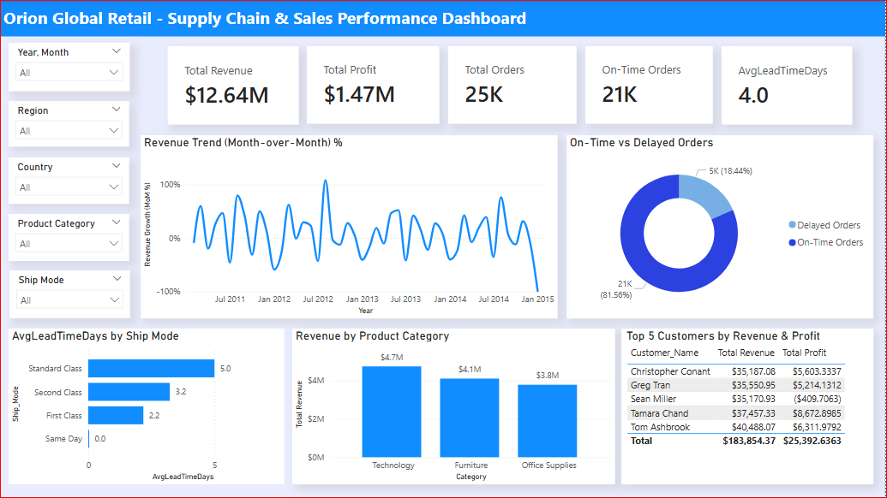
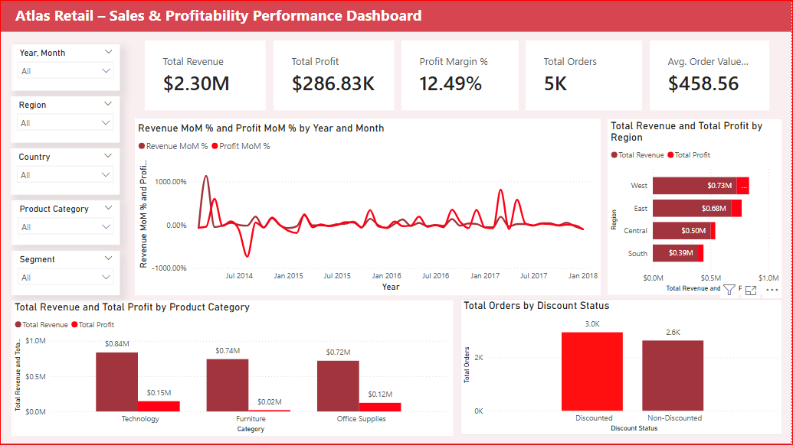

# Data Analytics Portfolio
# Project 1

**Title: [Orion Global Retail - Supply Chain & Sales Performance Dashboard](https://github.com/AbdulQuadrilebiyi/AbdulQuadrilebiyi.github.io/blob/main/Orion%20Global%20Retail_Dashboard.pbix)**

**Tools:** SQL Server, Power BI

**Purpose:**

To build an end-to-end business intelligence solution providing 
visibility into global supply chain performance, sales trends 
and profitability across regions, shipping modes and product categories.

**Business Problem:**

The business had raw transactional data with no structured way 
to monitor delivery performance, revenue trends or profitability. 
Key questions included which shipping modes cause delays, which 
regions and products drive the most revenue, and how discounting 
impacts profit.

**Approach:**

- Imported raw Excel data into SQL Server and performed full 
  data quality checks, null validation, duplicate detection 
  and foreign key integrity across orders, customers and products
- Used CTEs, JOINs and CASE statements to clean, deduplicate 
  and apply business logic, delivery lead times, on-time vs 
  delayed classification, discount flags and profitability status
- Imported clean views into Power BI, verified data integrity 
  and built a star schema, orders as the central fact table 
  connected to customers, products and a Calendar table
- Created DAX measures including Total Revenue, Total Profit, 
  On-Time Orders, Avg Lead Time, Profit Margin % and 
  Month-over-Month Revenue
- Designed an interactive dashboard with KPI cards, trend charts, 
  delivery performance visuals, category analysis and dynamic slicers

**Outcome:**

- Dashboard reveals overall revenue and profit performance 
  across all regions and time periods at a glance
- Over 80% of orders are delivered on time globally with 
  clear visibility into delayed shipments by region
- Standard Class shipping consistently shows the highest 
  average lead time compared to all other shipping modes
- Technology leads all product categories in revenue 
  generation followed closely by Furniture
- Top 5 customers are ranked by both revenue and profit 
  enabling targeted account management decisions

**Recommendations:**

- Review Standard Class shipping strategy to reduce lead 
  times and improve overall delivery performance
- Prioritise Technology and Furniture for inventory and 
  sales investment as they drive the highest revenue
- Reduce heavy discounting on low margin products to 
  protect overall profitability across all regions

**Tech Stack:**
- SQL Server - CTEs, Window Functions, JOINs, CASE statements,
  data quality checks and clean view creation
- Power BI - DAX measures, KPI cards, star schema data modelling
  with one-to-many relationships, calculated column, Calendar
  table, slicers and interactive dashboard design

[Download Power BI File (.pbix)](https://github.com/AbdulQuadrilebiyi/AbdulQuadrilebiyi.github.io/blob/main/Orion%20Global%20Retail_Dashboard.pbix) | [View SQL Script (.sql)](https://github.com/AbdulQuadrilebiyi/AbdulQuadrilebiyi.github.io/blob/main/OrionRetail.sql)

# Project 2

**Title: [Atlas Retail - Sales & Profitability Analytics Dashboard](https://github.com/AbdulQuadrilebiyi/AbdulQuadrilebiyi.github.io/blob/main/Atlas%20Retail_Dashboard.pbix)**

**Tools:** SQL Server, Power BI

**Purpose:**

To analyze retail sales performance and profitability across 
product categories, customer segments and regions — providing 
management with clear visibility into revenue drivers, margin 
trends and the commercial impact of discounting strategies.

**Business Problem:**

Leadership had no reliable way to measure profitability at 
category or segment level, or to understand whether discounting 
was helping or hurting the business. The core question was — 
are we growing revenue while protecting our margins, and which 
segments and regions are actually profitable?

**Approach:**

- Conducted end-to-end data validation across three raw tables —
  orders, customers and products — following Excel import into
  SQL Server
- Used CTEs, ROW_NUMBER() and RANK() Window Functions to
  deduplicate records and rank products and customers by revenue
- Applied INNER JOINs and CASE statements to classify discount
  status, profitability and order size per transaction
- Built monthly trend and profitability aggregations using
  GROUP BY, SUM, AVG and TOP queries
- Connected clean data into Power BI, built a star schema and
  created DAX measures for Profit Margin %, Average Order Value,
  Revenue MoM %, Profit MoM %, Discounted Orders and
  Last Month comparisons
- Designed a two page interactive dashboard with profitability
  visuals, regional comparisons, category breakdowns and
  discount impact analysis

**Outcome:**

- Technology category generates the highest revenue and profit
  while Office Supplies shows the weakest margin performance
- West region consistently outperforms all other regions
  in both revenue and profitability
- Discounted orders outnumber non-discounted orders showing
  heavy reliance on discounting to drive sales volume
- Average Order Value and Profit Margin KPIs provide management
  with a clear commercial performance baseline at any level
- Month-over-Month trends show significant volatility suggesting
  seasonal or promotional influences on revenue and profit

**Recommendations:**

- Reduce discount dependency especially on low margin product
  subcategories where discounting is eroding profitability
- Investigate Office Supplies margin performance and consider
  repricing or reducing promotional activity in this category
- Leverage the West region success model and apply similar
  strategies to Central and South regions to improve performance
- Use Average Order Value trends to identify opportunities
  for upselling and cross selling across customer segments

**Tech Stack:**

- SQL Server — CTEs, Window Functions including ROW_NUMBER()
  and RANK(), INNER and LEFT JOINs, CASE statements,
  data quality checks and clean view creation
- Power BI — DAX measures, KPI cards, star schema data
  modelling with one-to-many relationships, calculated
  columns, Calendar table, slicers and interactive
  dashboard design

[Download Power BI File (.pbix)](https://github.com/AbdulQuadrilebiyi/AbdulQuadrilebiyi.github.io/blob/main/Atlas%20Retail_Dashboard.pbix) | [View SQL Script (.sql)](https://github.com/AbdulQuadrilebiyi/AbdulQuadrilebiyi.github.io/blob/main/AtlasRetail.sql)

# Project 3

**Title: [Atlas Retail - Sales & Profitability Analytics Dashboard](https://github.com/AbdulQuadrilebiyi/AbdulQuadrilebiyi.github.io/blob/main/Atlas%20Retail_Dashboard.pbix)**
**Title:** [NovaCare Healthcare — Patient Operations Executive Dashboard](https://github.com/AbdulQuadrilebiyi/AbdulQuadrilebiyi.github.io/blob/main/NovaCare.xlsx)**

**Tools:** Excel

**Purpose:**
To analyze patient activity, billing trends and operational
performance across medical conditions, age groups and gender —
providing healthcare management with visibility into admission
patterns, length of stay and revenue performance.

**Business Problem:**
Hospital management had no structured way to monitor patient
admissions, track billing trends or understand which medical
conditions drive the longest stays and highest costs. The core
question was — how are our patients distributed and is our
billing performance consistent across conditions and months?

**Approach:**
- Imported raw patient dataset into Excel containing fields
  including Age Group, Gender, Medical Condition, Admission
  Type, Billing Amount, Length of Stay and Date of Admission
- Used Power Query to clean and transform the dataset
- Built multiple Pivot Tables to summarise patient activity —
  monthly admissions, billing by month, condition distribution,
  average length of stay and gender breakdown
- Created KPI summaries for Total Billing, Total Patients,
  Average Length of Stay and Emergency Admissions
- Designed an interactive dashboard with charts, KPI cards
  and slicers for Month, Medical Condition, Age Group and Gender

**Outcome:**
- Arthritis is the most common condition with the highest
  patient count followed closely by Diabetes
- Asthma patients have the longest average length of stay
  at 15.7 days while Diabetes patients have the shortest at 15.4
- Monthly patient admissions remain relatively stable
  throughout the year with August showing the highest volume
- Gender distribution is almost equal — Female 20,127
  and Male 20,108 — showing no significant gender bias
- Billing trends are consistent month to month with no
  significant seasonal spikes

**Recommendations:**
- Prioritise resource planning for Arthritis and Diabetes
  as they consistently represent the highest patient volumes
- Review care pathways for Asthma patients to explore
  opportunities to reduce average length of stay
- Maintain consistent staffing levels year round given
  the stable monthly admission pattern
- Investigate billing consistency across insurance providers
  to identify any revenue leakage or underbilling patterns

**Tech Stack:**
- Excel — Power Query for data cleaning and transformation,
  Pivot Tables for data summarisation, KPI cards, charts,
  slicers and interactive dashboard design

📥 [Download Excel File (.xlsx)](NovaCare.xlsx)
